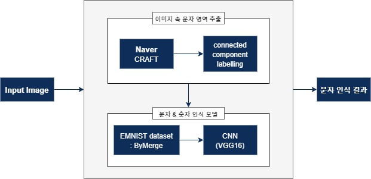
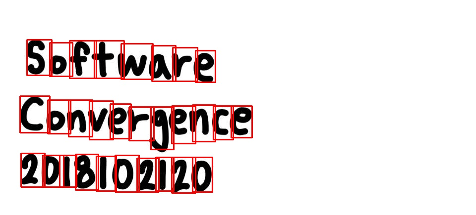
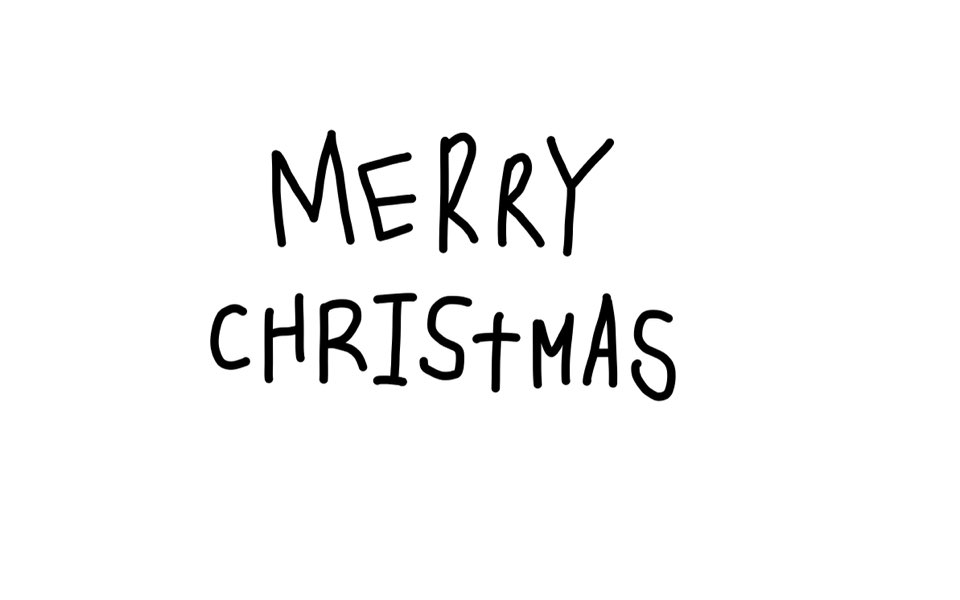
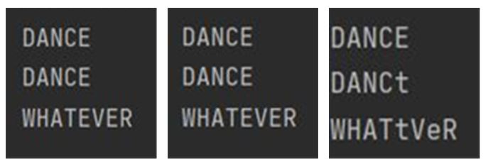

# 2020_Capstone design
 소프트웨어융합학과 옥수빈 _ 데이터분석 캡스톤 디자인
# OCR (with EMNIST Training Model)

 &nbsp;&nbsp;&nbsp;2020학년도 2학기 [데이터분석 캡스톤 디자인] 수업의 프로젝트 과제로 EMNIST 학습을 통한 효율적인 이미지 속 문자 인식 모델을 구성하기로 한다.<br/>
&nbsp;&nbsp;&nbsp;MNIST 데이터의 숫자를 분류하는 연구는 이미지를 분석하고 학습시켜 분류시키는 컴퓨터 비전 연구 분야에서 기초적인 연구로 많이 학습된다. 이에 대한 연구는 많이 진행되었고, 이를 효율적으로 학습시키는 모델들 역시 다양하게 구성되어 있다. 이번 캡스톤 디자인에서는 MNIST 데이터를 변형시킨 숫자와 문자로 구성된 EMNIST 데이터를 학습시키는 모델을 구현한 후, 이미지 속에서 문자 영역을 찾아내어 bounding box로 씌우고 그 문자를 인식하려고 한다. <br/>
 &nbsp;&nbsp;&nbsp;즉, 이번 프로젝트의 큰 과제는 1) 이미지 속에서 문자 영역을 추출하는 것과 2) 추출한 문자를 인식하는 것이다. 두 알고리즘을 통합하여 하나의 모델로 완성시키는 것을 목표로 한다.


## 1. 모델 설계

&nbsp;&nbsp;모델의 전반적인 구조는 [그림 1]과 같다.<br/>
<br/>
[그림 1] 모델의 구조

**1.1 이미지 속 문자 영역 추출**<br/>
&nbsp;&nbsp;첫 번째 과정은 이미지 속에서 문자를 찾아내는 과정이다. 현재 프로젝트에서는 오픈소스인 CRAFT와 Tesseract 오픈소스를 사용해본 후, 성능을 평가했다. EMNIST가 손글씨 데이터이기 때문에 손글씨 이미지를 인식시켜본 결과, CRAFT가 더 성능이 우수하다고 판단되어 이를 사용하기로 했다.
<br/>

**1.2 추출한 문자 인식**<br/>
&nbsp;&nbsp;이전 과정을 통해 추출한 문자 영역을 문자 인식 모델에 입력하여 어떤 문자/숫자인지 판별해내는 것이 최종 목표였기에, 문자 인식 모델을 구현해야 한다. 모델 학습을 위해 사용한 dataset은 EMNIST의 ByMerge dataset이며, CNN 구조를 활용한다. CNN의 여러 모델 중 1) ResNet, 2) VGGNet, 3) Inception 모델을 사용해보고, 성능을 비교해 모델을 완성시킨다. 
<br/>
&nbsp;&nbsp;이후, 인식된 문자 영역에는 주요 문자 뿐만 아니라 다른 문자의 일부가 포함될 수도 있기 때문에 이를 제거해주기 위한 과정이 필요하다. 이는 Connected Component Labelling 과정을 통해 수행된다.
<br/>

**#EMNIST dataset**<br/>
&nbsp;&nbsp;본 모델에서 문자 인식 모델을 구현하기 위해 사용한 EMNIST dataset은 ‘NIST Special Database 19’로부터의 필기 숫자/문자 데이터를 28x28 픽셀 이미지 형식으 로 바꾼 dataset으로, 구조는 MNIST dataset과 동일하다. 해당 dataset은 ByClass, ByMerge, Balanced, Letters, Digits, MNIST인 6가지의 다른 형태의 dataset으로 나뉜다. 
&nbsp;&nbsp;6가지 dataset 중에서 데이터 개수가 814,255개로 가장 많은 ByClass와 ByMerge 중에서 유사한 대소문자 클래스를 합병한 ByMerge dataset을 사용한다. ByMerge dataset의 구성 예시는 [그림 2]와 같다. 각 이미지 아래의 label 값은 숫자, 알파벳 label에 대한 아스키코드 값이다.

<br/>
[그림 2] EMNIST - ByMerge Dataset의 구성 예시


## 2. 모델 구현
**2.1 이미지 속 문자 영역 추출**<br/>
CRAFT의 코드를 본 프로젝트에서 원하는 방향으로 사용하기 위해서 다음과 같이 수정하도록 한다. <br\>
1. Character level bounding box 정보 추출 <br\>
&nbsp;&nbsp;CRAFT에서는 word level bounding box 정보를 추출하는 코드만 제공하기 때문에, character level bounding box 정보를 추출하는 코드를 추가 구현해야한다. 아래의 함수를 추가로 생성하면서 임계값을 수정해주면 기존의 word level로 추출되던 문자 이미지를 character level로 추출할 수 있게 된다. 아래 함수는 CRAFT 프로그램 내의 'detection.py' 등 기존에 word level 결과를 생성하던 곳에 추가되어있다. 

get_result_img 함수 추가
```
def get_result_img(image, score_text, score_link, text_threshold=0.68, link_threshold=0.4, low_text=0.08, ratio_w=1.0, ratio_h=1.0):  
    copyimg = image   
    boxes = getDetBoxes2(score_text, score_link, text_threshold, link_threshold, low_text, s=False)  
    boxes = adjustResultCoordinates2(copyimg, boxes, 1.0, 1.0)  
    file_utils.saveResult('character image 저장 이름', image, boxes, dirname='저장 주소')
```

<br/>
2. character 간의 순서 정렬
&nbsp;&nbsp;위 함수를 추가하여 character를 추출하면 기존 이미지 속 문자 순서대로 추출되지 않는다. 그렇기 때문에 아래의 함수를 추가하여 character들을 정렬해주는 과정이 필요하다. 이 함수는 'mainModel.py'에 구현되어 있다. 해당 과정은 1) word 영역 정보를 이용하여 각 word 영역 내의 character 분류해서 각각 다른 행의 배열에 저장, 2) 해당 행의 개수를 저장하는 배열(lineCharNum)을 생성하고 이는 word 내의 character 개수를 의미함, 3) (1)에서 저장한 character를 좌표 정보를 이용하여 순서대로 정렬하는 순서로 이루어진다. 여기서 (2)의 lineCharNum 배열은 이후에 문자 인식 결과를 출력할 때, 단어마다 구분하여 출력해주기 위해서 사용된다. 또한, 아래 함수에서 word 영역을 각각 10씩 늘려주는 이유는 간혹 character가 word 영역을 벗어나는 경우가 있기 때문이다. 어느 word 영역에 존재하는지만 파악하면 되기에 늘려주어도 상관없다.<br/>

```
def makeCharOrder(wordboxArray, charboxArray):
    resultArray = []

    firstIdx = 0
    lastIdx = 0

    for i in range(0, len(wordboxArray)):
        word = wordboxArray[i][0]
        wordX1 = math.floor(word[0][0]) - 10
        wordX2 = math.ceil(word[1][0]) + 10
        wordY1 = math.floor(word[0][1]) - 10
        wordY2 = math.ceil(word[2][1]) + 10

        for j in range(firstIdx, len(charboxArray)):
            char = charboxArray[j]
            charX1 = math.floor(char[0][0])
            charX2 = math.ceil(char[1][0])
            charY1 = math.floor(char[0][1])
            charY2 = math.ceil(char[2][1])

            if (j == len(charboxArray) - 1):
                if ((charX1 in range(wordX1, wordX2) and charX2 in range(wordX1, wordX2))
                        and (charY1 in range(wordY1, wordY2) and charY2 in range(wordY1, wordY2))):

                    lastIdx += 1

                    resultTemp = []
                    for x in range(firstIdx, lastIdx):
                        temp = []
                        char = charboxArray[x]
                        tempX1 = math.floor(char[0][0])
                        tempX2 = math.ceil(char[1][0])
                        tempY1 = math.floor(char[0][1])
                        tempY2 = math.ceil(char[2][1])

                        temp.append(tempX1)
                        temp.append(tempX2)
                        temp.append(tempY1)
                        temp.append(tempY2)

                        resultTemp.append(temp)

                    firstIdx = lastIdx
                    resultArray.append(resultTemp)
                    break

            if ((charX1 in range(wordX1, wordX2) and charX2 in range(wordX1, wordX2))
                    and (charY1 in range(wordY1, wordY2) and charY2 in range(wordY1, wordY2))):
                lastIdx += 1
                continue

            else:
                resultTemp = []
                for x in range(firstIdx, lastIdx):
                    temp = []
                    char = charboxArray[x]
                    tempX1 = char[0][0]
                    tempX2 = char[1][0]
                    tempY1 = char[0][1]
                    tempY2 = char[2][1]

                    temp.append(tempX1)
                    temp.append(tempX2)
                    temp.append(tempY1)
                    temp.append(tempY2)

                    resultTemp.append(temp)

                firstIdx = lastIdx
                resultArray.append(resultTemp)
                break

    lineCharNum = []
    for i in range (len(resultArray)):
        temp = len(resultArray[i])
        lineCharNum.append(temp)

    result = []
    for i in range(0, len(resultArray)):
        x1Array = []
        line = resultArray[i]
        for j in range(0, len(line)):
            x1Array.append(line[j][0])

        x1sorted = x1Array[:]
        x1sorted.sort()

        temp = []
        for j in range(0, len(line)):
            num = x1sorted[j]
            idx = x1Array.index(num)
            temp.append(line[idx])

        result.append(temp)
    return result, lineCharNum
```
<br/>
3. 문자 영역에서 주요 문자를 구분해내기 위해 다음의 connected component labelling 함수를 구현한다. 본 프로젝트에서는 해당 함수에서 영역을 10씩 늘려주는 부분과 EMNIST의 학습이 '검은 배경 + 흰색 글씨'로 이루어진 데이터셋에 대해서면 학습이 이루어져 있다는 점을 감안하여 동일하게 '흰 배경 + 검은색 글씨' 데이터에 대해서만 테스트 가능하다. <br/>

```
def connectedComponentLabelling(imageAdd):
    originImg = cv2.imread(imageAdd)
    img = cv2.cvtColor(originImg, cv2.COLOR_RGB2GRAY)

    _, th = cv2.threshold(img, 0, 255, cv2.THRESH_OTSU + cv2.THRESH_BINARY_INV)
    img = cv2.cvtColor(th, cv2.COLOR_GRAY2RGB)

    _, labels, bb, centroids = cv2.connectedComponentsWithStats(th)

    bbSize = []
    for i in range(1, len(bb)):
        size = bb[i][2] * bb[i][3]
        bbSize.append(size)

    maxIdx = bbSize.index(max(bbSize)) + 1
    resultBb = bb[maxIdx]

    x, y, w, h = resultBb[0], resultBb[1], resultBb[2], resultBb[3]

    result = img.copy()
    result = result[y:y+h, x:x+w]
    result = cv2.copyMakeBorder(result, 10, 10, 10, 10, cv2.BORDER_CONSTANT, value = [0,0,0])

    cv2.imwrite(imageAdd, result)
```

<br/>


**2.2 추출한 문자 인식**<br/>
&nbsp;&nbsp;CNN 모델 몇 가지를 구현한 후, EMNIST dataset에 입력했을 때 성능이 가장 좋은 모델을 사용하기로 결정했다. 각 모델을 구현한 후, 정확도를 높이기 위해 layer의 추가/삭제를 통한 구조의 변경 또는 learning rate, batch size 등의 parameter의 조정의 과정을 거쳤다. 해당 과정을 통해 생성된 가장 높은 validation accuracy를 가진 모델을 선택하였다. 정확도 면에서 큰 차이는 나지 않지만, VGGNet이 accuracy가 가장 높고 layer를 변경하기 쉽게 구현되어 있는 데다가 이후에 전체 모델의 성능 평가를 통해서 최종적으로 VGGNet을 모델로 선택하였다. 
<br/>

**2.3 최종 모델 구현**<br/>
&nbsp;&nbsp; **2.1**과 **2.2**에서 구현된 각각의 모델을 하나로 통합해주는 과정이다. 


## 3. 결과<br/>

### 첫 번째 이미지에 대한 결과
**첫 번째 실험**은 테스트를 위해 다운받은 이미지인 [그림 3]에 대한 것이다.<br/>

<br/>
[그림 3] 원본이미지 1
<br/><br/>

**3.1 이미지 속 character 영역 인식 및 추출**<br/>
[그림 4]는 각 원본이미지에 대해서 CRAFT 과정을 거친 후, bounding box를 그려 출력한 결과이다.

<br/>
[그림 4] 원본이미지 1에서 character 영역 인식 및 bounding box 생성

<br/>
&nbsp;&nbsp;생성된 각 character level의 bounding box별로 잘라서 별도의 character 이미지로 모두 저장한다.[그림 5]은 이미지의 character가 별도로 폴더에 저장된 모습이다.

<br/>
[그림 5] 원본이미지 1의 각 character 영역을 잘라 별도의 이미지로 저장<br/>

&nbsp;&nbsp;최종 문자 인식 결과는 성능의 비교를 위해 VGG 16, ResNet, GoogLeNet 모두의 결과를 저장한다. [그림 6]은 문자 인식 결과이다.

<br/>
[그림 6] 원본이미지 1의 문자 인식 결과 : 각각 VGG, ResNet, GoogLeNet<br/>
<br/>

### 두 번째 이미지에 대한 결과
**두 번째 실험**은 테스트를 위해 다운받은 이미지인 [그림 7]에 대한 것이다.<br/>

<br/>
[그림 7] 원본이미지 2
<br/><br/>

**3.1 이미지 속 character 영역 인식 및 추출**<br/>
[그림 8]는 각 원본이미지에 대해서 CRAFT 과정을 거친 후, bounding box를 그려 출력한 결과이다.

<br/>
[그림 8] 원본이미지 2에서 character 영역 인식 및 bounding box 생성

<br/>
&nbsp;&nbsp;생성된 각 character level의 bounding box별로 잘라서 별도의 character 이미지로 모두 저장한다.[그림 9]은 이미지의 character가 별도로 폴더에 저장된 모습이다.

<br/>
[그림 9] 원본이미지 2의 각 character 영역을 잘라 별도의 이미지로 저장<br/>

&nbsp;&nbsp;최종 문자 인식 결과는 성능의 비교를 위해 VGG 16, ResNet, GoogLeNet 모두의 결과를 저장한다. [그림 10]은 문자 인식 결과이다.

<br/>
[그림 10] 원본이미지 2의 문자 인식 결과 : 각각 VGG, ResNet, GoogLeNet<br/>
<br/>

### 세 번째 이미지에 대한 결과
**세 번째 실험**은 테스트를 위해 다운받은 이미지인 [그림 11]에 대한 것이다.<br/>

<br/>
[그림 11] 원본이미지 3
<br/><br/>

**3.1 이미지 속 character 영역 인식 및 추출**<br/>
[그림 12]는 각 원본이미지에 대해서 CRAFT 과정을 거친 후, bounding box를 그려 출력한 결과이다.

<br/>
[그림 12] 원본이미지 3에서 character 영역 인식 및 bounding box 생성

<br/>
&nbsp;&nbsp;생성된 각 character level의 bounding box별로 잘라서 별도의 character 이미지로 모두 저장한다.[그림 13]은 이미지의 character가 별도로 폴더에 저장된 모습이다.

<br/>
[그림 13] 원본이미지 3의 각 character 영역을 잘라 별도의 이미지로 저장<br/>

&nbsp;&nbsp;최종 문자 인식 결과는 성능의 비교를 위해 VGG 16, ResNet, GoogLeNet 모두의 결과를 저장한다. [그림 14]은 문자 인식 결과이다.

<br/>
[그림 14] 원본이미지 3의 문자 인식 결과 : 각각 VGG, ResNet, GoogLeNet<br/>
<br/>

### 네 번째 이미지에 대한 결과
**네 번째 실험**은 테스트를 위해 다운받은 이미지인 [그림 15]에 대한 것이다.<br/>

<br/>
[그림 15] 원본이미지 4
<br/><br/>

**3.1 이미지 속 character 영역 인식 및 추출**<br/>
[그림 16]는 각 원본이미지에 대해서 CRAFT 과정을 거친 후, bounding box를 그려 출력한 결과이다.

<br/>
[그림 16] 원본이미지 4에서 character 영역 인식 및 bounding box 생성

<br/>
&nbsp;&nbsp;생성된 각 character level의 bounding box별로 잘라서 별도의 character 이미지로 모두 저장한다.[그림 17]은 이미지의 character가 별도로 폴더에 저장된 모습이다.

<br/>
[그림 17] 원본이미지 4의 각 character 영역을 잘라 별도의 이미지로 저장<br/>

&nbsp;&nbsp;최종 문자 인식 결과는 성능의 비교를 위해 VGG 16, ResNet, GoogLeNet 모두의 결과를 저장한다. [그림 18]은 문자 인식 결과이다.

<br/>
[그림 18] 원본이미지 4의 문자 인식 결과 : 각각 VGG, ResNet, GoogLeNet<br/>
<br/>


### 시연 동영상


## 4. 사용 방법<br/>
&nbsp;&nbsp;프로그램을 사용하려면 소스코드 전체를 다운받은 후, 'modelMain.py' 파일을 수정해야 한다. 수정사항은 다음과 같으며, 수정이 필요한 부분은 해당 파일 내부에 주석으로 표시를 해놓았다.
 
 &nbsp;&nbsp;&nbsp;&nbsp;1) 테스트할 이미지의 주소 : imageAdd 변수<br/>
 &nbsp;&nbsp;&nbsp;&nbsp;2) character별 이미지의 저장 주소 : saveAdd 변수<br/>
 &nbsp;&nbsp;&nbsp;&nbsp;3) bounding box가 그려진 이미지의 저장 주소 : boudingBoxAdd 변수<br/>
 &nbsp;&nbsp;&nbsp;&nbsp;4) 사용할 모델의 h5 파일이 저장된 주소 : model 변수에 저장될 함수 load_model의 parameter 값<br/>
   
